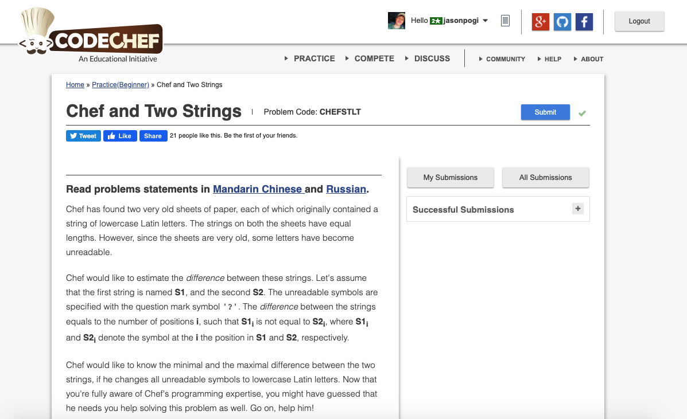

# Codechef-Chef-and-Two-Strings
### Problem  

### Program Simulation
<pre>
  x = 0, y = 0

  Input: ?abac, ?aba?w

  x++
  x = 1
  y++=
  y = 1
  y++
  y = 2
  x++
  x = 2
  y++
  y = 3

  print y
  print x + y

  Final Output:
  3 5
</pre>
